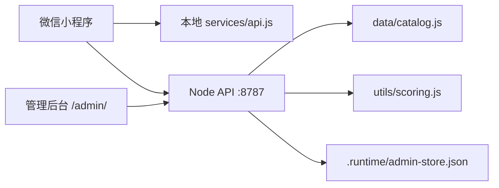

# 架构说明

## 当前技术栈

- 小程序前端：原生微信小程序，`WXML`、`WXSS`、`JavaScript`。
- 后端服务：Node.js 内置 `http` 模块，零依赖 REST API。
- 管理后台：静态 HTML、CSS、JavaScript，由 Node 服务托管。
- 数据快照：官方公开资料接口抓取后生成 `data/catalog.json` 和 `data/catalog.js`。
- 测试：Node.js 内置断言和 `node:test`。

## 运行结构

## 目录职责

- `pages/`：小程序页面。
- `services/api.js`：小程序本地服务层和远程 API 适配层。
- `utils/`：资料查询、评分、订阅和资产策略。
- `server/`：Node API、管理接口和静态后台托管。
- `.runtime/`：本地运行时数据目录，默认保存管理后台 store、阵容样本和审计日志，不进入版本库。
- `admin/`：管理后台静态资源。
- `scripts/`：官方资料抓取和快照生成。
- `tests/`：数据、评分和后端接口测试。

## 后端边界

当前后端是原型：目录、评分、阵容保存、对位、账号优化和战报导入接口已经具备 HTTP 形状；管理后台支持规则草案、资产审核记录、阵容样本、审计日志、store 导出和 store 重置。默认管理数据保存到 `.runtime/admin-store.json`，也可以在测试里通过 `createApp({ storeFile })` 指定临时文件，或用 `storeFile: false` 使用内存 store。

## 阵容同步链路

小程序默认仍把阵容保存到本地 storage。用户在“我的分析台”切换远程 API 后，评分页保存阵容会先写本地，再调用 `POST /api/v1/lineups` 同步服务端；远程失败时保留本地阵容并展示失败原因。“我的分析台”进入时会通过 `GET /api/v1/lineups` 拉取远程样本并与本地记录按 `id` 合并。管理后台通过 `GET /api/admin/lineups` 展示最近阵容样本，当前只用于观察保存行为，不作为胜率训练数据。

生产化前必须补：

- PostgreSQL 或等价数据库。
- 正式登录、角色权限和管理审计。
- 用户体系、阵容归属和服务端删除/恢复能力。
- 微信支付、订阅状态、订单回调和权益校验。
- 评分规则版本化和灰度发布。
- 原创卡牌资产生成队列、相似度审核和人工复核记录。
- 战报样本入库、去重、可信度分层和隐私处理。
