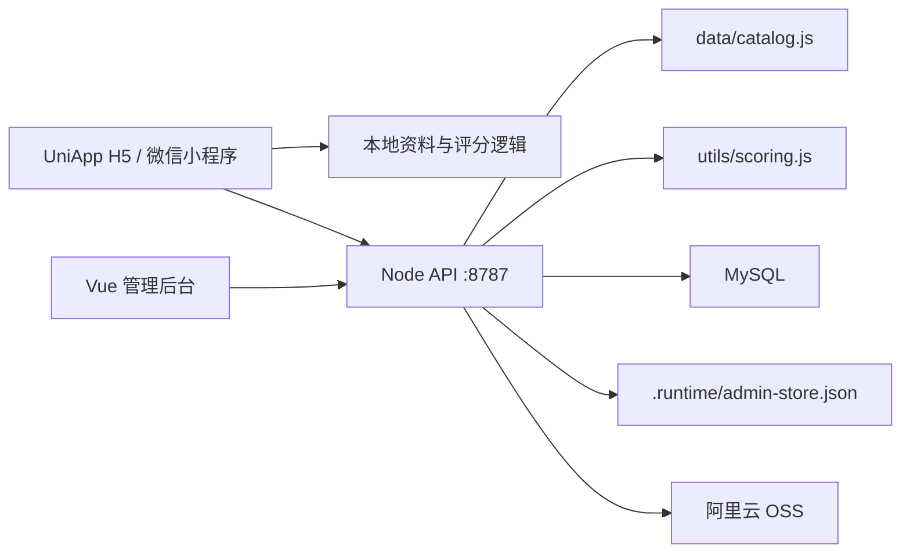

# 架构说明

更新时间：2026-06-03。

## 当前技术栈

- 前台：UniApp + Vue，目录为 `src/`，支持 H5 和微信小程序构建。
- 后端：Node.js 内置 `http` 模块，目录为 `server/`。
- 管理后台：Vue 3 + Vite + Element Plus，目录为 `admin/`。
- 数据库：MySQL，当前用于账号、抽卡、战报、反馈等生产化数据。
- 原型运行时存储：`.runtime/admin-store.json`，当前仍用于部分管理后台规则、资产审核、审计和部分阵容样本。
- 资料快照：`data/catalog.json` 和 `data/catalog.js`。
- 共享逻辑：`utils/`、`services/` 给 Node 侧使用，`src/utils/`、`src/services/` 给 UniApp 侧使用。
- 测试：Node.js 内置断言和 `node:test`。

## 运行结构

## 目录职责

- `src/pages/analyze/`：评分工作台，选择场景、兵种、武将、战法和红度，输出解释型报告。
- `src/components/search-picker.vue`：武将和战法搜索选择器。
- `src/pages/catalog/`：资料库检索。
- `src/pages/draw/`：抽卡日历、保底、赛季和统计。
- `src/pages/matchup/`：对位预览、战斗结果记录和战报统计入口。
- `src/pages/account/`：登录状态、订阅、保存阵容、抽卡统计、账号级共存分析和同步入口。
- `src/pages/login/`：用户名/密码登录注册。
- `src/pages/feedback/`：意见反馈提交。
- `src/services/api.js`：UniApp 的本地/远程 API 适配。
- `src/utils/`：前台资料、评分、抽卡、订阅、资产和本地存储工具。
- `server/app.js`：HTTP 路由、CORS、静态后台托管和管理接口。
- `server/db.js`：MySQL 建表、用户、抽卡、阵容、战报、反馈和权益数据访问。
- `server/store.js`：`.runtime` 管理后台 store。
- `server/oss.js`：OSS 上传和图片 URL 生成。
- `admin/src/views/`：后台仪表盘、反馈、阵容、资料、规则和审计页面。
- `scripts/`：资料抓取、部署、卡牌上传和图标生成脚本。
- `tests/`：资料、评分、服务端和抽卡存储测试。

## 前台数据流

前台默认可以离线使用本地资料快照和本地评分逻辑。用户登录或切换远程 API 后，`src/services/api.js` 会把请求发往后端。

主要链路：

- 评分：本地 `src/utils/scoring.js` 或远程 `POST /api/v1/lineups/analyze`。
- 资料：本地 `src/utils/catalog.js` 或远程 catalog 接口。
- 保存阵容：先写本地 `savedLineups`，远程模式下再调用后端。
- 抽卡：当前页面主体使用本地 `drawStorage`，账号页提供远程同步入口。
- 对位：本地规则预览或远程 `POST /api/v1/matchups/preview`。
- 战报：远程模式下调用 MySQL-backed 战报接口。
- 反馈：直接调用远程反馈接口。

## 后端数据边界

当前后端同时存在两类存储：

- MySQL：账号、抽卡池、抽卡记录、战报、反馈，以及部分阵容同步能力。
- `.runtime/admin-store.json`：评分规则草案、原创资产审核、审计日志，以及部分阵容保存/后台展示能力。

这是当前最重要的架构风险之一。阵容接口已经出现双存储边界：

- `POST /api/v1/lineups` 写入 `.runtime` store。
- `POST /api/v1/lineups/sync` 写入 MySQL。
- `GET /api/v1/lineups` 当前读取 `.runtime` store。

下一轮应把阵容读写统一到 MySQL，并让后台只读取同一份来源；`.runtime` 只保留真正的本地原型数据或彻底移除。

## 管理后台边界

后台通过 `x-admin-token` 访问管理接口。当前登录页只是保存后台 token，不是完整用户认证系统。

当前后台页面：

- 仪表盘：服务状态、资料数量、规则、阵容和审计摘要。
- 意见反馈：读取反馈列表并修改状态。
- 阵容管理：查看和删除阵容样本。
- 资料数据：查看武将和战法资料。
- 评分规则：编辑规则草案。
- 审计日志：查看管理操作记录。

生产化前必须补：

- 正式管理员账号体系和角色权限。
- 高风险操作二次确认。
- 后台操作审计字段细化。
- 用户、抽卡、战报和订阅权益的统一后台视图。

## 配置与安全

生产环境必须通过环境变量或密钥系统提供：

- `ADMIN_TOKEN`
- `TOKEN_SECRET`
- `MYSQL_HOST`
- `MYSQL_PORT`
- `MYSQL_USER`
- `MYSQL_PASSWORD`
- `MYSQL_DATABASE`
- `WX_APPID`
- `WX_SECRET`
- `OSS_ACCESS_KEY_ID`
- `OSS_ACCESS_KEY_SECRET`
- `OSS_BUCKET`
- `OSS_ENDPOINT`
- `OSS_PREFIX`
- `OSS_CDN_DOMAIN`

凭据不得写入仓库文档、脚本日志或提交记录。历史文档如曾出现明文凭据，需要按生产安全流程轮换。

数据库配置按环境分开：

- 本地开发和本地测试未设置 `MYSQL_USER` 时，后端默认使用 `root` 空密码连接本机 MySQL；如果 `sgzzlb_local` 数据库不存在，初始化过程会自动创建数据库和表。服务端测试固定使用这套本地库。
- 生产环境不得依赖本地默认值，必须显式配置 `MYSQL_*`，数据库名通常为生产库名。

## 当前已知风险

- 阵容远程保存、同步和读取存在 `.runtime` 与 MySQL 分裂。
- CORS 允许头目前未显式包含 `authorization`，H5 远程登录态请求需要复核。
- 前台资料摘要有异步返回形态，资料页展示数量需要复核是否正确等待 Promise。
- 后台本地开发应使用 Vite dev server；生产由后端托管已构建的 `admin/dist`。
- 部署文档已改为环境变量口径，但如果历史提交包含真实凭据，需要轮换。
